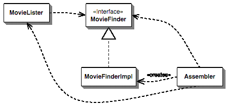

<style>
    .yellow {
        color: #ffee00
    }
    strong {
        color: #ffee00
    }
    section {
        background: #111111;
        color: white;
    }
</style>

<!-- _class:
- lead
-->

<h1>DI, IoC, &<span class="yellow"> You</span></h1>

Dependency Injection, Inversion of Control, and You

October 17, 2023

---

# Outline

1. Inversion of Control
2. Dependency Injection
3. `django-di`

---

# What is Inversion of Control?

The **idea** that a library calls your code instead of you calling a library (framework).

> Don't call us, we'll call you (Hollywood's Law)

---

# What is Inversion of Control?

Instead of

```
your code => library
```

with IoC

```
your code <= library (inverted)
```

<!-- Show `ioc*.py` examples after this slide -->

---

# Examples of Inversion of Control
- Tkinter
- unittest (`setUp`, `tearDown`, ...)
- Django views (called by Django framework)

---

# What is Dependency Injection?

An IoC **technique** for separating **construction** from **use**.

We pass a class its dependencies instead of creating them within the class.

$10 word for a 5𝇍 concept

---

<!-- _class:
- lead
-->

<style scoped>
    section {
        background: white;
    }
</style>


---

<!-- _class:
- lead
-->

<style scoped>
    section {
        background: white;
    }
</style>


---

<!-- _class:
- lead
-->

<style scoped>
    section {
        background: white;
    }
</style>



---

# What are some benefits of DI?

- Decreased coupling
- Testability
- Composability (_"has a"_, not _"is a"_)

---

# Auto Dependency Injection

Taking things a step further with DI Containers

---

<!-- _class:
- lead
-->

# Summary

Zupah kewl summary

---

<!-- _class:
- lead
-->

# Questions?

---

<!-- _class:
- lead
-->

# Thank you all for coming! 👋

---

# References

- https://martinfowler.com/articles/injection.html
- https://martinfowler.com/bliki/InversionOfControl.html

